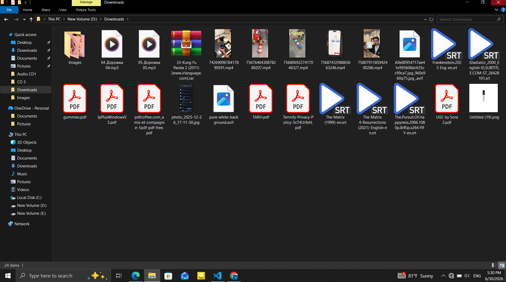
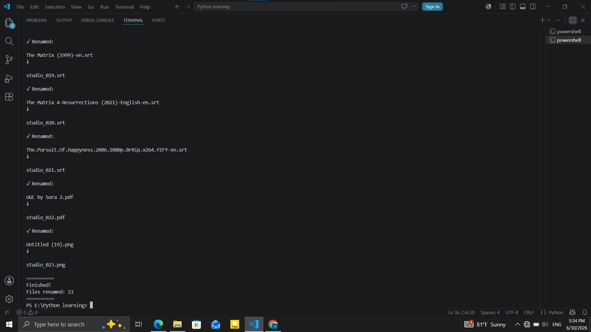
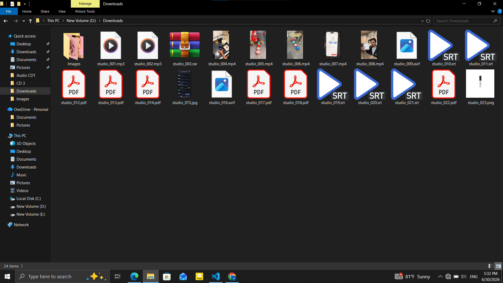

# 📝 Python Bulk File Renamer


---

##   Overview

Automatically renames files in bulk using a custom prefix while preserving their original file extensions.

---

## ⭐ Why this project matters

Renaming files one by one is repetitive and inefficient, especially when dealing with large collections of photos, documents, or media files.

This tool automates the process by applying consistent filenames, saving time and reducing manual work.

---
## 🖥️ Demo

### 🔍 Before Execution & Runtime Overview

<p align="center">
  
  
</p>

---

### ✨ Post-Execution Result

<p align="center">
  
</p>


## 🧠 Key Features

- 📝 Renames files in bulk with a custom prefix
- 🔢 Automatically numbers files using leading zeros (001, 002, 003...)
- 📂 Preserves original file extensions
- 🚫 Skips folders and common hidden/system files
- ⚠️ Prevents duplicate filenames
- 💬 Interactive confirmation before renaming
- 📊 Displays every renamed file and a summary


---

## 🛠️ Tech Stack

- Python 3
- pathlib
- sys

---


## 🚀 How to Run

1. Clone this repository.

```bash
git clone https://github.com/DevBlueprintLab/python-bulk-file-renamer.git
```

2. Open a terminal in the project folder.

3. Run the script.

```bash
python file_renamer.py
```

The script will safely rename all supported files while preserving their original extensions.

## 📊 Example Output

```text
Enter folder path:
D:\RenameTest

Enter a prefix:
Holiday

Rename files (y/n)?
y

✓ Renamed:

IMG001.jpg
↓

Holiday_001.jpg

✓ Renamed:

IMG002.jpg
↓

Holiday_002.jpg

Finished!

Files renamed: 8
```

---

## 📁 Project Structure

```text
RenameTest/
├── Holiday_001.jpg
├── Holiday_002.jpg
├── Holiday_003.png
├── Holiday_004.pdf
└── ...
```

---

## 📚 What I Learned

- Working with `pathlib`
- Renaming files safely
- Validating user input
- Handling duplicate filenames
- Skipping hidden and system files
- Building interactive command-line tools
- Writing cleaner and more maintainable Python code

---

## 🚀 Future Improvements

- Add suffix support in addition to prefixes
- Preview changes before renaming files
- Allow renaming based on dates or metadata
- Add undo functionality
- Build a graphical user interface (GUI)

---

Created by **DevBlueprint Lab**
