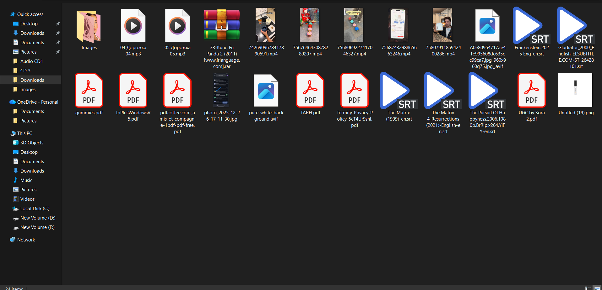
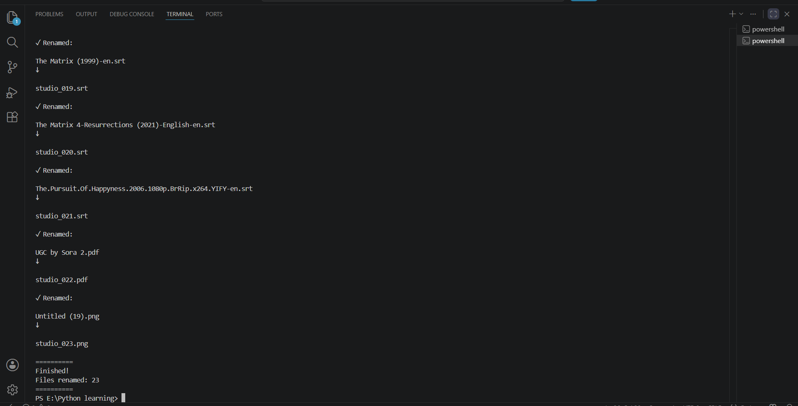
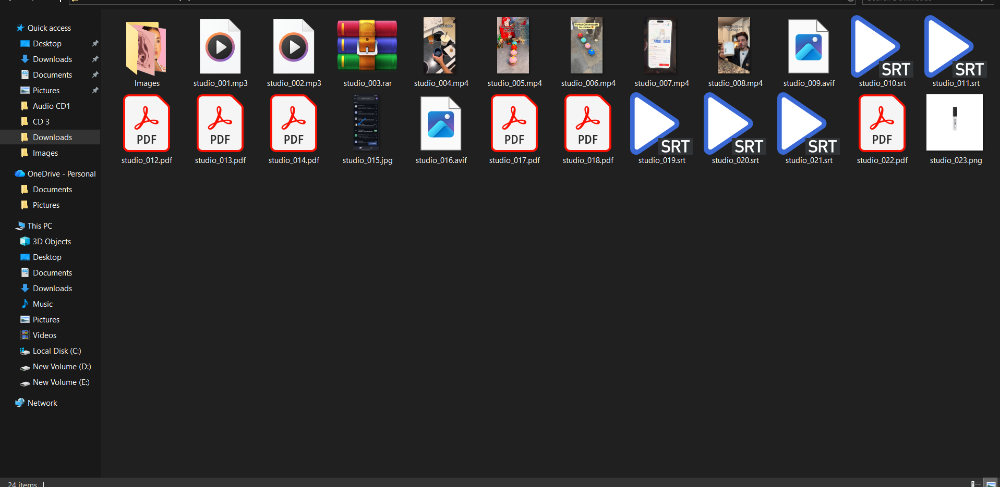

# 📝 Python Bulk File Renamer


A Python automation tool that renames multiple files in a directory using a consistent naming pattern while preserving their original file extensions.

The program validates the target folder, applies sequential numbering, prevents filename conflicts, and safely skips directories and common system files during processing.

---

# 🖥️ Demo

### Original Files ➜ Automated Renaming ➜ Renamed Files

<p align="center">
  
  
</p>

<p align="center">
  
</p>

---

# 🎯 Problem

Renaming large groups of files manually is repetitive and time-consuming. Maintaining consistent filenames is especially important when organizing photos, documents, datasets, or project assets.

---

# ✅ Solution

This tool automates batch file renaming by:

- Renaming files using a custom user-defined prefix
- Applying sequential numbering with leading zeros
- Preserving original file extensions
- Avoiding filename conflicts automatically
- Skipping folders and common system files
- Requesting confirmation before making changes

---

# ⚡ Core Features

- 📝 **Batch File Renaming**  
  Renames every supported file inside the selected directory using a custom prefix.

- 🔢 **Sequential Numbering**  
  Applies automatic numbering in the format `001`, `002`, `003`, and so on.

- 📂 **Extension Preservation**  
  Keeps each file's original extension unchanged during renaming.

- 🚫 **Safe Directory Processing**  
  Ignores subfolders as well as common hidden and system files such as `Thumbs.db` and `desktop.ini`.

- ⚠️ **Conflict Prevention**  
  Automatically checks for existing filenames and adjusts numbering to prevent overwriting files.

- ✅ **Confirmation Before Execution**  
  Requires user confirmation before applying any file changes.

---

# 🛠️ Tech Stack

- **Language:** Python 3.x
- **File Handling:** `pathlib`
- **System Utilities:** `sys`

**External Dependencies:** None

---

# 🚀 Quick Start

## 1. Clone the repository

```bash
git clone https://github.com/DevBlueprintLab/python-bulk-file-renamer.git

cd python-bulk-file-renamer
```

## 2. Run the tool

```bash
python bulk_file_renamer.py
```

## 3. Provide the folder path and filename prefix

Example:

```text
Enter folder path:
D:\RenameTest

Enter a prefix:
Holiday

Rename files (y/n)?
y

✓ Renamed:

IMG001.jpg
↓

Holiday_001.jpg

✓ Renamed:

IMG002.jpg
↓

Holiday_002.jpg

==========

Finished!

Files renamed: 8

==========
```

---

# 📁 Project Structure

```text
python-bulk-file-renamer/

├── bulk_file_renamer.py      # Main automation script
├── README.md                 # Project documentation
├── LICENSE                   # MIT License
└── images/
    ├── folder-before.png
    ├── renaming-process.png
    └── folder-after.png
```

---

# 💼 Practical Use Cases

This automation tool can help with:

- Organizing photo collections
- Renaming scanned documents
- Preparing datasets for machine learning
- Standardizing project assets
- Managing files before backup or archival

---

# 🔮 Future Improvements

- Add suffix-based renaming
- Add preview mode before execution
- Support date- and metadata-based renaming
- Add undo functionality
- Develop a graphical user interface (GUI)

---

# 📜 License

This project is licensed under the MIT License.

---

Developed by **DevBlueprintLab**
